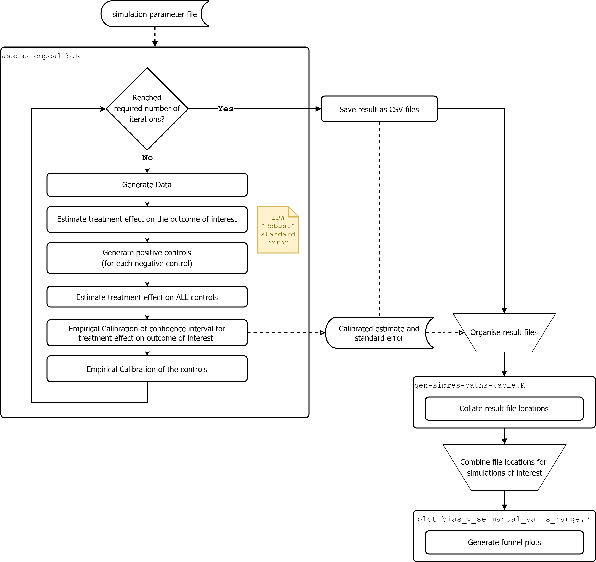

# Assessing the effectiveness of empirical calibration

Please refer to our paper [Assessing the effectiveness of empirical calibration under different bias scenarios](https://arxiv.org/abs/2111.04233) for more details.

## Installation

1. Clone the repository
2. Install R-tools
3. Fetch and install the required R packages by restoring the renv project library
   
   The renv package (https://cran.r-project.org/web/packages/renv/index.html) is used to track R packages used in this project. To install the R packages used in the project, first install renv (if not already) by issuing the following command in R console
   
   ```R
   install.packages("renv")
   ```
   The renv.lock file contains information on R packages to install. Issue the following command in R console, within the project’s directory to fetch and install the packages used in this project:
   ```R
   renv::restore() 
   ```
  
   This may result in a message stating the ``project has not yet been activated``—answer `Y` (yes) to active the project. Also answer `Y` to proceed with fetching and installation.


## Running the simulation



#### Command line

To launch the simulation, run the script `assess-empcalib.R` with CSV parameter file as an argument. The CSV file contains parameters of the simulation. 

```shell
Rscript ./assess-empcalib.R ./data/config/unmeasuredconf/simconfig-unmeasuredconf-ideal-5negctrl.csv
```

#### Rstudio
To run `assess-empcalib.R` from an integrated development environment (IDE)
such as RStudio, assign the variable `settings_file` to the location of a
configuration file.

https://github.com/clinical-ai/assess-empcalib/blob/9f4c48fda13edc6a0019e635d838d54e6e06e5e4/assess-empcalib.R#L44

#### Simulation parameters

Configuration files in `data/config` define the simulation settings.
The configuration file to use is specified when running
`assess-empcalib.R` from the command line. The command line setup allows many simulations to be run in parallel on a batch processing
system such as Portable Batch System (PBS).

Some important parameters are described below:

|     Parameter                                               |     Meaning                                                                                                                    |     Example value    |
|-------------------------------------------------------------|--------------------------------------------------------------------------------------------------------------------------------|----------------------|
|     sim_shortdesc                                           |     Short text description of simulation.   Used to generate output directories.                                               |                      |
|     seed_outcome_coef_rand                                  |     Whether to set a seed for R session.                                                                                       |     FALSE            |
|     n_sims                                                  |     Number of simulations                                                                                                      |     500              |
|     n_obs_persim                                            |     Number of observations per simulations                                                                                     |     50000            |
|     n_negctrls                                              |     Number of negative controls                                                                                                |     15               |
|     same_measured_eff_to_all_outcomes_per_sim_iter          |     Determines whether coefficients in model   should be all randomly generated (FALSE value) or same for all (ideal case).    |     TRUE             |
|     nprocess                                                |     Number of CPU processes. The simulation   uses multiple processes, one process for a simulation.                           |     4                |


If the configuration file is not supplied, the script defaults to the
unmeasured confounder simulation scenario.

## Results

Initial results are stored under `data/sim-binaryoutcome` directory as
CSV files. Plots generated during the simulation are stored under
`graphs` as PDF files.

After completion of each simulation, results should be moved to another
directory so as to avoid mixing results from multiple simulations.

The script `gen-simres-paths-table.R` can be used to collate the results if required.
However, it expects the results to be in a specific directory structure.
Therefore, before collating the results and *after each* simulation, move the results files to the directory expected by the collation
script.

#### Collating location of simulation results

The code in `gen-simres-paths-table.R` collects the locations of results of each simulation
scenario into a CSV file. A specific simulation scenario can be specified by
the variable `sim_scenario`. The resulting CSV files are used for plotting results.

The `gen-simres-paths-table.R` script expects the initial results from simulations to be
stored in a specific directory structure. Therefore, before collating the results,
move the results *after each* simulation to directory with the following format

    data/resdata-paths/<YYYY-MM-DD>/<SCENARIO>/<NEGCTRL_STRUCT>/negctrl_<NUM_NEGCTRL>/<COEF>/data

where the values between `<` and `>` reflect the simulation settings; these can be found from
the name of the setting file used to run the simulation.

  - `YYYY-MM-DD` is the datetime of the simulation in the result file (e.g., `simres_raw-20220601-`)
  - `SCENARIO` is one of the following values
    `{unmeasured_conf, quadratic, x1x2intr, measurement_error, nonpositivity}`
  - `NEGCTRL_STRUCT` can be one of `{negctrl_causalstruct, negctrl_nocausalstructure}`
  - `NUM_NEGCTRL` can take on value such as `05` or `30`
  - `COEF` can be one of `{allrand, ideal}`
  
For the example simulation, the recommendation is to create and move the simulation results to

  `data/resdata-paths/20220601/unmeasured_conf/negctrl_causalstruct/negctrl_05/idea/data`

The collation process will create files under `data/resdata-paths/<YYYY-MM-DD>` , 
which contain locations of the result files for plotting. 

#### Plots

The `plot-bias_v_se-manual_yaxis_range.R` script generates the funnel plots from the manuscript). It allows the y-axis of plots in each simulation scenario to be specified so
figures can be made consistent. It calls other functions to perform the actual plotting. By default, the plotting script expects the content of files from `gen-simres-paths-table.R` to be combined (e.g.,
using a text editor) so that it can locate the results for all the simulation scenarios.
However, only the locations of the scenarios of interest are necessary. The variable
`alldata_respath_file` holds the location of this combined file (defaults to a file named
`data/resdata-paths/res_data-paths-all_scenarios.csv`).

Individual plots for each scenario can be plotted by changing the filtering parameters to read
the combined file. Individual plots are placed inside cells of a template, `figures-template.svg`.
This template can be open in drawing tools such as diagrams.net (formerly draw.io).

#### Calculating mean difference of average bias

The script `calc_avgdiffabsbias.R` contains code that reads the collated simulation result
file (generated by `gen-simres-paths-table.R`) and calculates the mean differences. As with plotting, this script expects all the collated results to be combined into one large file;
by default it is looking for
`data/resdata-paths/res_data-paths-all_scenarios.csv` (the same file used for plotting).

The results are saved as a CSV file under the directory `data/simres_avg_diffabsbias/<YYYY-MM-DD>/`

## Citation
Please acknowledge the following work in papers or derivative software:  
Hwang, Hon, Juan C. Quiroz, and Blanca Gallego. "Assessing the effectiveness of empirical calibration under different bias scenarios." arXiv preprint arXiv:2111.04233 (2021).
